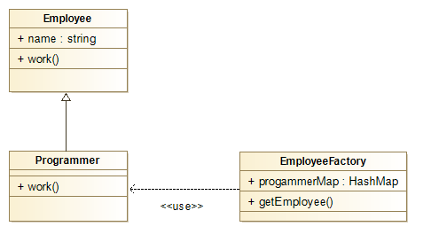

# 【デザインパターン】Flyweight

## 初めに　
社内勉強会で、「一つのデザインパターンを選んで、皆に紹介してください。」と言われた時に、迷わずFlyweightを選んだ。なぜかというと、「Flyweight」は、ボクシングなどの格闘技で用いられる階級の一つで体重軽い階級だと分かっているが、デザインパターンにおいて、軽いのは一体なにを意味しているかなと興味が湧いたからだ。

## なにか
一言でいうと、オブジェクトを生成する時、すでに作成済みのインスタンスを再作成せず、それを再利用することで、メモリの消費を抑えるデザインパターンである。

## なぜか
オブジェクトを生成するには、メモリを確保する(インスタンス化)必要がある。多くのオブジェクトを生成すると当然ながらメモリが多く消費されてしまう。メモリは無限に使える ものではないため、常に効率よく活用する必要がある。 

## どんな場合か
1. 多くのオブジェクトを生成する場合 
1. 一つのオブジェクト生成にかなりメモリを消費する場合 
1. オブジェクトの状態は外部化できる場合 
1. システムはこのオブジェクト達のIDに依存しない場合 

## ポイント
- ファクトリーデザインパターンを利用する
    - オブジェクトの生成はファクトリーに任せる
- オブジェクトのプール
    - 可能なオブジェクトを事前にプールに登録し、それが要求された場合、プールからそのオブジェクトを返す

## JAVA実装例

会社で従業員に仕事を割り振りることを例にしてサンプルアプリケーションを作成する。
- 待機従業員ワーキングプールを事前に用意し、待機する従業員はプールに登録する。
- 仕事があるときは待機している従業員の一人にその仕事を割り振りする。
- 従業員がまだ準備できていない場合は準備させてワーキングプールに登録する。

ここで、従業員は生成対象のオブジェクトとなり、同じ従業員に仕事を割り振りすると きは事前に作成したその従業員のオブジェクトを再利用することで、オブジェクトの再生 成がしなくて済む。

### クラス図

### Step1

会社員のインターフェースを作成

```java
public interface Employee {
	void work();
}
```

### Step2

プログラマーのクラスを作成

```java
public class Programmer implements Employee {
	
    public Programmer(String name) {
		super(name);
	}

	@Override
	public void work() {
		System.out.println(name + "さんが仕事中です。");
	}
}
```
### Step3

プログラマーのファクトリーを作成

```java
public class EmployeeFactory {

	private static final ConcurrentHashMap<String, Employee> progammerMap = new ConcurrentHashMap<>();

	public static Employee getEmployee(String name) {
		
		Programmer programmer = (Programmer) progammerMap.get(name);

		if (programmer == null) {
            	//初めて生成する場合
			programmer = new Programmer(name);
			progammerMap.put(name, programmer);
			System.out.println(name + "さんが準備しました。待機中です。");
		}
		return programmer;
	}
}
```
### Step4

テストクラス

```java
public class TestDemo {

	private static final String names[] = { "王", "鍾", "向", "添峰", "云" };

	public static void main(String[] args) {

		for (int i = 0; i < 20; i++) {
			Programmer programmer = (Programmer) EmployeeFactory.getEmployee(getRandomName());
			programmer.work();
		}
	}

	private static String getRandomName() {
		return names[(int) (Math.random() * names.length)];
	}
}
```

### Step5

実行すると

```
鍾さんが準備しました。待機中です。
鍾さんが仕事中です。
王さんが準備しました。待機中です。
王さんが仕事中です。
王さんが仕事中です。
添峰さんが準備しました。待機中です。
添峰さんが仕事中です。
云さんが準備しました。待機中です。
云さんが仕事中です。
向さんが準備しました。待機中です。
向さんが仕事中です。
向さんが仕事中です。
向さんが仕事中です。
添峰さんが仕事中です。
王さんが仕事中です。
鍾さんが仕事中です。
云さんが仕事中です。
王さんが仕事中です。
向さんが仕事中です。
添峰さんが仕事中です。
云さんが仕事中です。
云さんが仕事中です。
鍾さんが仕事中です。
向さんが仕事中です。
向さんが仕事中です。
```
## 既に実装したJDKの例

Integer.valueOf()でFlyweightパターンが使われているので、早速ソースを見てみよう。
```java
public static Integer valueOf(int i) {
    if(i >= IntegerCache.low  && i <= IntegerCache.high)
        return IntegerCache.cache[i + (-IntegerCache.low)];
    else
        return new Integer(i);
}
```

cacheHighは基本的には127で、IntegerCache.lowは-128なので、つまり-128から127までのIntegerオブジェクトはあらかじめ作ってある。
以下のようなテストでちょっと確認してみる。
```java
public class testInteger {
	public static void main(String[] args) {
		Integer a = 127;
		Integer b = Integer.valueOf(127);
		Integer c = Integer.valueOf(127);

		System.out.println(a == b ? "a == b" : "a != b");
		System.out.println(a == c ? "a == c" : "a != c");
		System.out.println(b == c ? "b == c" : "b != c");

		System.out.println("----------");

		Integer aa = 128;
		Integer bb = Integer.valueOf(128);
		Integer cc = Integer.valueOf(128);

		System.out.println(aa == bb ? "aa == bb" : "aa != bb");
		System.out.println(aa == cc ? "aa == cc" : "aa != cc");
		System.out.println(bb == cc ? "bb == cc" : "bb != cc");
	}
}
```

実行すると
```
a == b
a == c
b == c
----------
aa != bb
aa != cc
bb != cc
```

## 後書き
メモリの消費を抑える点において、結構有効なデザインパターンだけど、欠点として少なくともファクトリー、プールの仕組みが必要となるようにシステムの複雑さをあげてしまう。

更に、外部状態（共通するメンバ変数）と内部状態（個別のメンバ変数）を分離しないと、システムを混乱させてしまう。

実際利用したい場合はこのデザインパターンのメリットデメリットをてから、本当に必要かどうかを判断して利用しましょう。